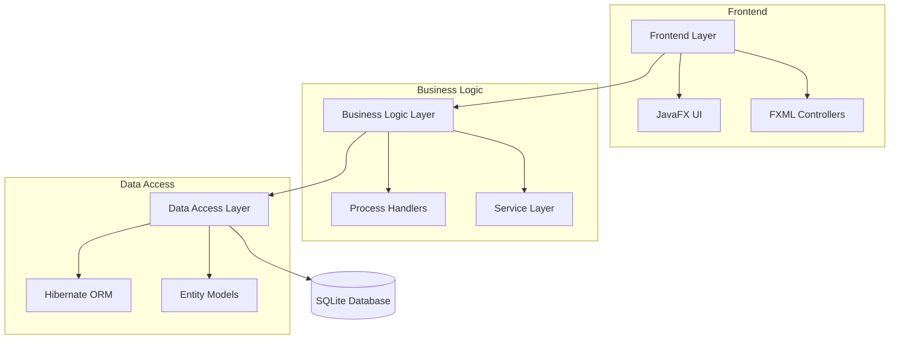
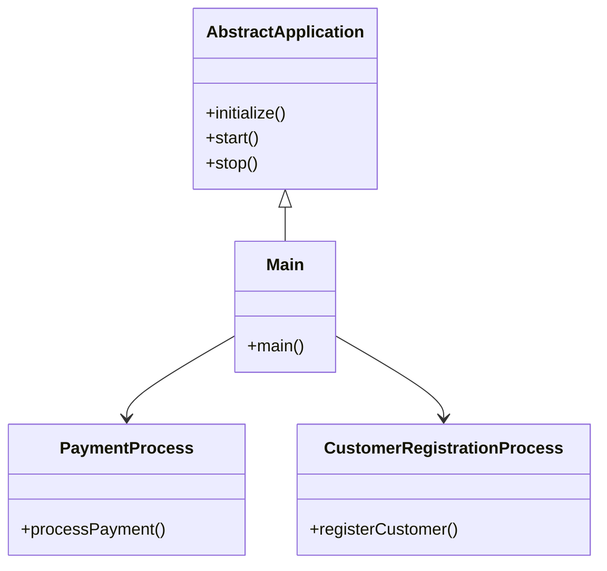

# Developer Documentation

## Project Overview
This is a booking application built using Java and JavaFX, utilizing a modern tech stack for robust functionality and user experience. The application follows a layered architecture pattern with clear separation between frontend and backend components.

## Architecture

### System Architecture
The application follows a layered architecture with the following main components:

1. **Presentation Layer (Frontend)**
   - Built with JavaFX (version 24.0.1)
   - FXML-based UI layouts
   - MVC (Model-View-Controller) pattern implementation

2. **Business Logic Layer**
   - Core business logic implementation
   - Process handling (Payment, Customer Registration)
   - Abstract application framework

3. **Data Access Layer**
   - Hibernate ORM integration
   - SQLite database connectivity
   - Entity management and persistence



## Technology Stack

### Core Technologies
1. **Java**
   - Version: Java 24
   - Build System: Maven
   - Compiler Configuration: JDK 1.8 compatible

2. **Frontend Framework**
   - JavaFX 24.0.1
   - FXML for UI layouts

3. **Database**
   - SQLite 3.49.1
   - Hibernate ORM 6.6.13.Final for data persistence

4. **Testing Framework**
   - JUnit Jupiter 5.10.2
   - Mockito 5.11.0 for mocking

### Dependencies
```xml
Core Dependencies:
- javafx-controls:24.0.1
- javafx-fxml:24.0.1
- hibernate-core:6.6.13.Final
- sqlite-jdbc:3.49.1.0

Testing Dependencies:
- junit-jupiter-api:5.10.2
- junit-jupiter-engine:5.10.2
- mockito-core:5.11.0
- mockito-junit-jupiter:5.11.0
```

## Class Structure



## Security and Encryption

### Database Security
- SQLite database with secure connection handling
- Hibernate ORM for secure data access and manipulation
- Prepared statements to prevent SQL injection

### Authentication & Authorization
- User authentication system
- Role-based access control
- Session management

## Build and Deployment

### Build Configuration
The project uses Maven for build automation. Key plugins:
- maven-compiler-plugin (3.14.0)
- maven-surefire-plugin (3.2.5)
- javafx-maven-plugin (0.0.8)

### Build Commands
```bash
# Clean and build the project
mvn clean install

# Run the application
mvn clean javafx:run

# Run tests
mvn test
```

## Testing

### Testing Framework
- JUnit Jupiter for unit testing
- Mockito for mocking dependencies
- Integration tests for database operations

### Test Categories
1. Unit Tests
   - Business logic testing
   - Service layer testing
   - Utility class testing

2. Integration Tests
   - Database operations
   - External service integrations

## Development Guidelines

### Code Style
- Follow Java naming conventions
- Use meaningful variable and method names
- Document public APIs and complex logic
- Keep methods focused and single-responsibility

### Version Control
- Use feature branches for new development
- Write meaningful commit messages
- Review code before merging to main branch

### Best Practices
1. Error Handling
   - Use appropriate exception handling
   - Log errors with sufficient context
   - Implement graceful degradation

2. Performance
   - Use connection pooling for database operations
   - Implement caching where appropriate
   - Optimize UI rendering

3. Maintainability
   - Follow SOLID principles
   - Write clean, self-documenting code
   - Maintain proper documentation

## Troubleshooting

### Common Issues
1. Database Connection
   - Verify SQLite file permissions
   - Check connection string
   - Ensure proper Hibernate configuration

2. UI Issues
   - Verify FXML file locations
   - Check scene graph hierarchy
   - Validate event handlers

### Logging
- Implement comprehensive logging
- Use appropriate log levels
- Include relevant context in log messages

## Future Improvements
1. Consider implementing:
   - Caching layer for improved performance
   - Additional security measures
   - API documentation generation
   - Containerization support 