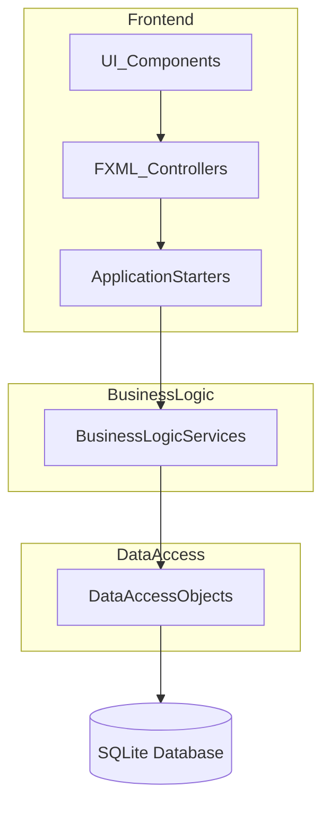
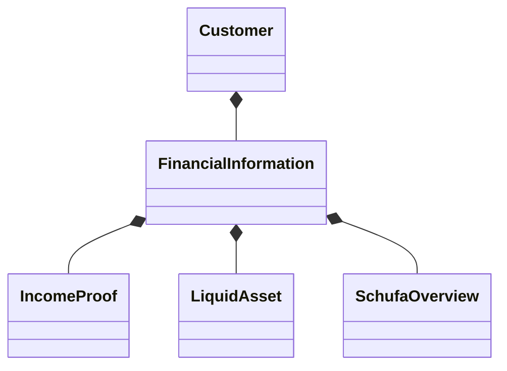
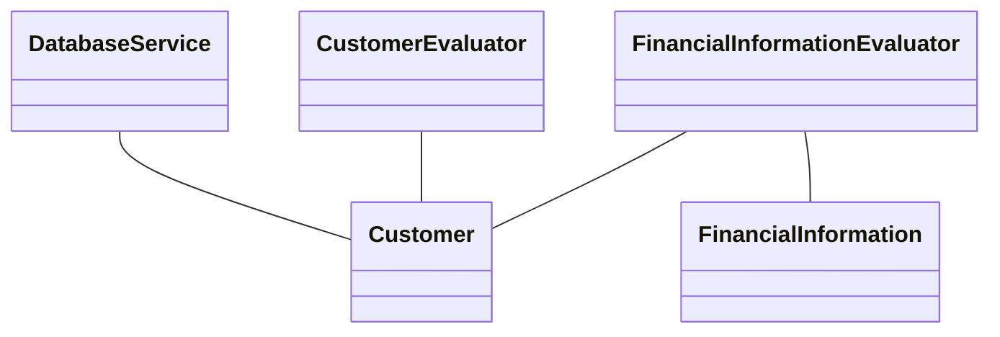
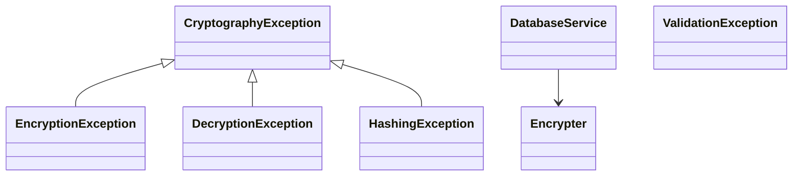

# Developer Documentation

## Project Overview
This is a booking application built using Java and JavaFX, utilizing a modern tech stack for robust functionality and user experience. The application follows a layered architecture pattern with clear separation between frontend and backend components. It features separate entry points for different application flows like Customer Registration and Payment Processing.

## Architecture

### System Architecture
The application follows a layered architecture with the following main components:

1. **Presentation Layer (Frontend)**
   - Built with JavaFX (version 23.0.2)
   - FXML-based UI layouts
   - MVC (Model-View-Controller) pattern implementation

- **Location**: `src/main/java/com/atdit/booking/frontend/`
- **Primary Responsibilities**: User interface, input handling, view management
- **Key Classes**:
  ```
  ├── Controller/
  │   ├── AbstractApplication
  │   ├── Controller (abstract)
  │   ├── Page3PersonalInformationController
  │   ├── Page4DeclarationFIController
  │   ├── Page5ProofFIController
  │   ├── Page6CreateAccountController
  │   ├── Page7ControllerPageLogin
  │   ├── Page9aCreditCardController
  │   └── Page9bBankTransferController
  ```
- **Interfaces**:
  - `Navigatable`: Navigation between pages
  - `Cacheable`: Data persistence between views

2. **Business Logic Layer**
   - Core business logic implementation
   - Process handling (Payment, Customer Registration)
   - Abstract application framework

- **Location**: `src/main/java/com/atdit/booking/backend/`
- **Primary Responsibilities**: Business rules, data validation, process management
- **Key Classes**:
  ```
  ├── customer/
  │   ├── Customer
  │   └── CustomerEvaluator
  ├── financialdata/
  │   ├── financial_information/
  │   │   ├── FinancialInformation
  │   │   ├── IncomeProof
  │   │   ├── LiquidAsset
  │   │   └── SchufaOverview
  │   └── processing/
  │       ├── FinancialInformationEvaluator
  │       ├── FinancialInformationParser
  │       └── FinancialDocumentsGenerator
  ├── PaymentProcess
  └── CustomerRegistrationProcess
  ```

3. **Data Access Layer**
   - Hibernate ORM integration
   - SQLite database connectivity
   - Entity management and persistence

- **Location**: `src/main/java/com/atdit/booking/backend/database/`
- **Primary Responsibilities**: Database operations, data encryption, persistence
- **Key Classes**:
  ```
  ├── database/
  │   ├── DatabaseService
  │   └── Encrypter
  └── exceptions/
      ├── CryptographyException
      └── ValidationException
  ```



## Technology Stack

### Core Technologies
1. **Java**
   - Version: Java 24 (as per maven-compiler-plugin release 24)
   - Build System: Maven
   - Compiler Configuration: JDK 1.8 compatible

2. **Frontend Framework**
   - JavaFX 23.0.2
   - FXML for UI layouts

3. **Database**
   - SQLite 3.49.1
   - Hibernate ORM 6.6.13.Final for data persistence

4. **Testing Framework**
   - JUnit Jupiter 5.10.2
   - Mockito 5.11.0 for mocking

### Dependencies
```xml
Core Dependencies:
- javafx-controls:24.0.1
- javafx-fxml:24.0.1
- hibernate-core:6.6.13.Final
- sqlite-jdbc:3.49.1.0

Testing Dependencies:
- junit-jupiter-api:5.10.2
- junit-jupiter-engine:5.10.2
- mockito-core:5.11.0
- mockito-junit-jupiter:5.11.0
```

## Detailed Class Structure

### Core Domain Model



### Service Layer



### Frontend Controllers
The `Main.java` class has been refactored into `CustomerRegistrationApplicationStarter.java` and `PaymentProcessApplicationStarter.java`, which extend `AbstractApplication`. These serve as the main entry points.

```mermaid
classDiagram
    AbstractApplication <|-- CustomerRegistrationApplicationStarter
    AbstractApplication <|-- PaymentProcessApplicationStarter
    PageController <|-- Page3PersonalInformationController

    class AbstractApplication
    class CustomerRegistrationApplicationStarter
    class PaymentProcessApplicationStarter
    class PageController
    class Page3PersonalInformationController
    // Add other PageXController inheritance from PageController if applicable
```

### Security and Encryption



## Build and Deployment

### Build Configuration
The project uses Maven for build automation. Key plugins:
- maven-compiler-plugin (3.14.0) configured for Java 24 (`<release>24</release>`)
- maven-surefire-plugin (3.2.5)
- javafx-maven-plugin (0.0.8)
  - Main class for Customer Registration: `com.atdit.booking/com.atdit.booking.CustomerRegistrationApplicationStarter`
  - (Note: Payment Process might have a different run configuration if needed)

### Build Commands
```bash
# Clean and build the project
mvn clean install

# Run the application
mvn clean javafx:run

# Run tests
mvn test
```

## Testing

### Testing Framework
- JUnit Jupiter for unit testing
- Mockito for mocking dependencies
- Integration tests for database operations

### Test Categories
1. Unit Tests
   - Business logic testing
   - Service layer testing
   - Utility class testing

2. Integration Tests
   - Database operations
   - External service integrations

### Test Coverage Report

| Component                    | Class Coverage | Method Coverage | Line Coverage | Branch Coverage |
|-----------------------------|----------------|-----------------|---------------|-----------------|
| Backend        | 57%            | 64%             | 46%           | 56%             |


### Running Tests
```bash
# Run all tests
mvn test

# Run specific test class
mvn test -Dtest=Page7ControllerPageLoginTest

# Run with coverage report
mvn verify
``` 

## Development Guidelines

### Code Style
- Follow Java naming conventions
- Use meaningful variable and method names
- Document public APIs and complex logic
- Keep methods focused and single-responsibility

### Version Control
- Use feature branches for new development
- Write meaningful commit messages
- Review code before merging to main branch

### Best Practices
1. Error Handling
   - Use appropriate exception handling
   - Log errors with sufficient context
   - Implement graceful degradation

2. Performance
   - Use connection pooling for database operations
   - Implement caching where appropriate
   - Optimize UI rendering

3. Maintainability
   - Follow SOLID principles
   - Write clean, self-documenting code
   - Maintain proper documentation

## Troubleshooting

### Common Issues
1. Database Connection
   - Verify SQLite file permissions
   - Check connection string
   - Ensure proper Hibernate configuration

2. UI Issues
   - Verify FXML file locations
   - Check scene graph hierarchy
   - Validate event handlers

### Logging
- Implement comprehensive logging
- Use appropriate log levels
- Include relevant context in log messages

## Future Improvements
1. Consider implementing:
   - Caching layer for improved performance
   - Additional security measures
   - API documentation generation
   - Containerization support


